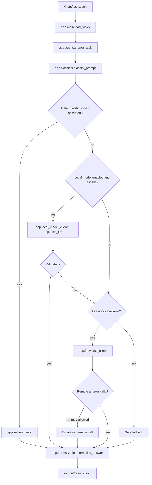

# Juggernaut Router

Juggernaut Router is a token-conscious hybrid routing agent for AMD Developer Hackathon Act II, Track 1. It receives natural-language tasks, classifies the task category, and routes each request to the most appropriate available path: a deterministic solver, an optional local GGUF model, or a Fireworks remote model.

The container follows the Track 1 contract:

- Read tasks from `/input/tasks.json`
- Write answers to `/output/results.json`
- Use `FIREWORKS_BASE_URL` for every Fireworks request when remote inference is used
- Select only models supplied through `ALLOWED_MODELS`

## Problem

Using a large remote model for every request is expensive and inefficient. Some Track 1 tasks are simple enough for deterministic code, some can be handled by a small local model, and others need remote model quality. The challenge is to preserve correctness while reducing unnecessary remote token usage.

## Solution

Juggernaut Router uses a measured pipeline:

1. Load tasks from the configured input path.
2. Normalize task fields into `task_id` and `prompt`.
3. Classify the prompt into a supported task category.
4. Try a deterministic solver when the task is safe and verifiable.
5. Optionally try local GGUF inference when enabled and allowed for the category.
6. Use Fireworks remote inference when local paths are unavailable, rejected, or risky.
7. Normalize and validate the answer.
8. Write official-shaped results to the configured output path.

## Key Features

- Category-based routing across the eight Track 1 capability categories
- Deterministic solvers for safe exact tasks
- Optional local GGUF inference with `llama-cpp-python`
- Fireworks fallback through the injected base URL
- Configurable remote model preferences constrained by `ALLOWED_MODELS`
- Structured validation and output normalization
- Dockerized `linux/amd64` runtime
- Startup and finish diagnostics for local debugging
- Local smoke, fixture scoring, Docker, and submission-readiness scripts

## Architecture



Main implementation files:

| Area | Path |
| --- | --- |
| Entrypoint and IO | `app/main.py` |
| Routing pipeline | `app/agent.py` |
| Prompt classification | `app/classifier.py` |
| Deterministic solvers | `app/solvers/basic.py` |
| Local GGUF inference | `app/local_model_client.py`, `app/local_llm.py` |
| Fireworks inference | `app/fireworks_client.py` |
| Output normalization | `app/normalization.py` |
| Answer validation | `app/validators.py` |
| Runtime configuration | `app/config.py` |
| Telemetry logging | `app/telemetry.py` |
| Tests | `tests/test_phase1_runtime.py`, `tests/test_phase2_router.py` |

See [docs/ARCHITECTURE.md](docs/ARCHITECTURE.md) for a deeper walkthrough.

## Routing Strategy

The router recognizes the eight Track 1 categories:

| Category | Typical route behavior |
| --- | --- |
| Factual knowledge | Deterministic for known safe patterns; otherwise remote when available |
| Mathematical reasoning | Deterministic for recognized arithmetic patterns; otherwise remote |
| Sentiment classification | Deterministic/local when safe; remote for ambiguous cases |
| Text summarisation | Deterministic/local for recognized concise patterns; remote for strict or risky summaries |
| Named entity recognition | Deterministic for recognized extraction patterns; remote for ambiguous or strict cases |
| Code debugging | Deterministic templates for known bugs; remote or local model for code-shaped tasks when enabled |
| Logical/deductive reasoning | Deterministic for recognized puzzles; remote for deeper reasoning |
| Code generation | Deterministic templates for simple functions; remote or local model for code-shaped tasks when enabled |

The exact implementation intentionally lives in the source code and tests rather than in public documentation. See [docs/ROUTING.md](docs/ROUTING.md).

## Models

Remote model aliases are configured at runtime and must be present in `ALLOWED_MODELS`. The Dockerfile includes default preference lists for:

- `minimax-m3`
- `kimi-k2p7-code`
- `gemma-4-31b-it`
- `gemma-4-26b-a4b-it`
- `gemma-4-31b-it-nvfp4`

The Fireworks client intersects preference lists with `ALLOWED_MODELS` before making a call.

Local inference is optional. The current Docker build arguments default to:

- Model repository URL: `https://huggingface.co/Qwen/Qwen2.5-3B-Instruct-GGUF/resolve/main/qwen2.5-3b-instruct-q4_k_m.gguf`
- Runtime filename: `local-model.gguf`
- Runtime path: `/app/models/local-model.gguf`

Local weights are used only when `ENABLE_LOCAL_MODEL=true` at build time and `LOCAL_MODEL_ENABLED=true` at runtime.

## Requirements

- Docker with `linux/amd64` support for submission builds
- Python 3.11+ for local scripts and tests
- Optional Fireworks credentials for remote live tests
- Optional GGUF model file for local-model-enabled builds
- Network access for Fireworks routes and for downloading local weights during local-model builds, unless weights are already present in `models/`

## Quick Start

```bash
git clone https://github.com/antoinemawad/juggernaut-router.git
cd juggernaut-router

cp .env.example .env

python3 -m unittest discover -s tests

INPUT_PATH=examples/sample_tasks.json \
OUTPUT_PATH=/tmp/juggernaut-results.json \
python3 -m app.main

python3 scripts/validate_submission_io.py /tmp/juggernaut-results.json
cat /tmp/juggernaut-results.json
```

The sample run does not require Fireworks credentials. Remote-dependent tasks will use safe fallback unless Fireworks variables are configured.

## Docker

Standard build:

```bash
docker build --platform linux/amd64 -t juggernaut-router:local .
```

Run with the sample fixture:

```bash
mkdir -p /tmp/juggernaut-output
docker run --rm --platform linux/amd64 \
  -v "$PWD/examples:/input:ro" \
  -v /tmp/juggernaut-output:/output \
  -e INPUT_PATH=/input/sample_tasks.json \
  juggernaut-router:local

python3 scripts/validate_submission_io.py /tmp/juggernaut-output/results.json
```

Local-model-enabled build:

```bash
docker build --platform linux/amd64 \
  --build-arg ENABLE_LOCAL_MODEL=true \
  --build-arg LOCAL_MODEL_FILENAME=local-model.gguf \
  -t juggernaut-router:local-model .
```

If `models/local-model.gguf` exists in the build context, the Dockerfile uses it. Otherwise, it downloads from `LOCAL_MODEL_URL`. Do not commit GGUF weights to Git; bundle them into the Docker image from the build machine.

## Configuration Reference

Full configuration is documented in [docs/CONFIGURATION.md](docs/CONFIGURATION.md). The most important variables are:

| Name | Kind | Required | Default | Purpose |
| --- | --- | --- | --- | --- |
| `INPUT_PATH` | runtime | no | `/input/tasks.json` | Task input path |
| `OUTPUT_PATH` | runtime | no | `/output/results.json` | Result output path |
| `FIREWORKS_API_KEY` | runtime | for remote | none | Fireworks authentication |
| `FIREWORKS_BASE_URL` | runtime | for remote | none | Judging proxy or Fireworks-compatible base URL |
| `ALLOWED_MODELS` | runtime | for remote | none | Comma-separated model aliases allowed by evaluator |
| `ROUTER_PROFILE` | runtime | no | Dockerfile default | Runtime profile |
| `ROUTER_MODE` | runtime | no | Dockerfile default | Conservative/balanced/aggressive/accuracy-first mode |
| `LOCAL_MODEL_ENABLED` | runtime | no | build-dependent | Enables local GGUF calls |
| `LOCAL_MODEL_PATH` | runtime | no | `/app/models/local-model.gguf` | Default GGUF path |
| `ROUTER_LOG_PATH` | runtime | no | none | Optional JSONL telemetry log path |
| `ENABLE_LOCAL_MODEL` | build arg | no | `false` | Installs local inference dependencies and bundles/downloads GGUF |

## Example Input and Output

Input:

```json
[
  {
    "task_id": "demo_sentiment",
    "prompt": "Classify the sentiment as positive, negative, or neutral. Return only the label: The setup was fast and the results were reliable."
  }
]
```

Output:

```json
[
  {
    "task_id": "demo_sentiment",
    "answer": "positive"
  }
]
```

See `examples/` for a safe synthetic sample.

## Testing

Unit and routing tests:

```bash
python3 -m unittest discover -s tests
```

Static submission guard:

```bash
python3 scripts/check_submission_static.py
```

Fixture scoring:

```bash
INPUT_PATH=local_test/input/tasks.json \
OUTPUT_PATH=/tmp/juggernaut-results.json \
python3 -m app.main

python3 scripts/score_submission_fixture.py \
  local_test/input/tasks.json \
  /tmp/juggernaut-results.json
```

Docker runtime guard:

```bash
python3 scripts/check_docker_runtime.py
```

Container smoke test:

```bash
python3 scripts/run_container_accuracy_smoke.py \
  --image juggernaut-router:local \
  --input-dir local_test/accuracy_gate_input
```

Remote API environment check:

```bash
python3 scripts/check_live_eval_env.py --print-models
```

Do not run live remote model matrix commands unless credentials are available and token usage is intended.

## Repository Structure

```text
app/                  Runtime agent, routing, model clients, validation
app/solvers/          Deterministic solver implementations
docs/                 Architecture, configuration, demo, and planning notes
eval/                 Local evaluation and model-matrix tooling
examples/             Safe synthetic demo input/output
local_test/           Local fixtures for smoke and accuracy checks
scripts/              Validation, demo, Docker, and analysis utilities
tests/                Unit and routing tests
Dockerfile            Submission container build
requirements*.txt     Python dependency manifests
```

## Limitations

- Classification can be wrong on ambiguous prompts.
- Some tasks depend on remote Fireworks models for quality.
- Local GGUF inference requires extra image size, memory, and startup/runtime budget.
- Model-based routes can vary across runs.
- Deterministic solvers intentionally cover only recognized safe patterns.
- Credentials are required for live remote tests and must be supplied at runtime.

## Security

- Never commit `.env`, API keys, tokens, private endpoints, or GGUF model weights.
- Pass secrets through environment variables only.
- Logs redact known secret fields, but avoid logging private task content in public demos.
- Sample files use synthetic prompts and placeholders.
- The Docker image should include only runtime files needed by `app/`.

## License

No `LICENSE` file is currently present. Add an explicit license before public redistribution if the repository owner intends to open-source the project.

## Demo and Presentation

- Live demo guide: [docs/DEMO.md](docs/DEMO.md)
- Presentation notes: [docs/PRESENTATION_NOTES.md](docs/PRESENTATION_NOTES.md)
- Video script: [docs/VIDEO_SCRIPT.md](docs/VIDEO_SCRIPT.md)
- Final checklist: [docs/JUDGING_CHECKLIST.md](docs/JUDGING_CHECKLIST.md)
