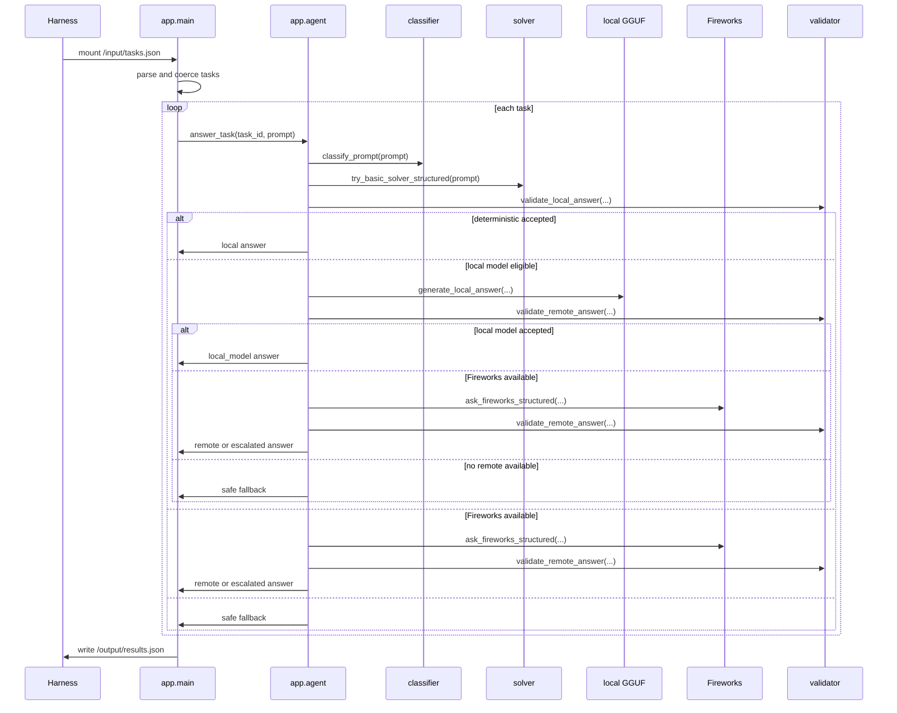
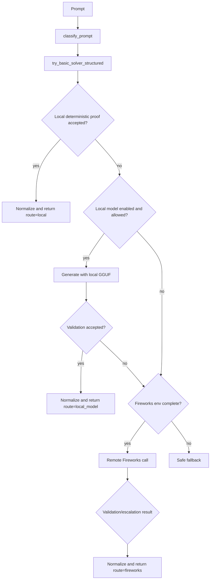

# Architecture

Juggernaut Router is a batch-oriented Track 1 agent. It starts once, reads a JSON task file, writes a JSON results file, then exits.

## Components

| Component | File | Responsibility |
| --- | --- | --- |
| Entrypoint | `app/main.py` | Load tasks, run tasks concurrently, write results, emit startup/finish diagnostics |
| Runtime config | `app/config.py` | Parse environment variables and recommendation exports |
| Classifier | `app/classifier.py` | Categorize prompts and infer answer shape, constraints, and risk components |
| Router | `app/agent.py` | Coordinate deterministic, local-model, Fireworks, validation, fallback, and telemetry paths |
| Deterministic solvers | `app/solvers/basic.py` | Return exact answers for recognized safe prompt patterns |
| Local inference | `app/local_model_client.py`, `app/local_llm.py` | Call optional GGUF model through `llama-cpp-python` or external command |
| Remote inference | `app/fireworks_client.py` | Call Fireworks-compatible chat completions through `FIREWORKS_BASE_URL` |
| Normalization | `app/normalization.py` | Normalize model and solver answers into expected shapes |
| Validation | `app/validators.py` | Accept or reject local/remote answers based on task constraints |
| Telemetry | `app/telemetry.py` | Write optional JSONL route and timing records |

## Request Lifecycle



## Routing Decision Flow



## Deterministic vs Model-Based Execution

Deterministic solvers run first. They are intended for recognized, low-risk prompts where the system can produce and validate an exact answer locally.

Local model execution is optional and controlled by `LOCAL_MODEL_ENABLED`, `LOCAL_MODEL_PATH`, `LOCAL_MODEL_CATEGORIES`, and related local-model variables. Local answers still pass through validation before being accepted.

Remote execution uses `FIREWORKS_BASE_URL`, `FIREWORKS_API_KEY`, and `ALLOWED_MODELS`. Model preferences are configurable, but the client only uses models allowed by the runtime environment.

## Failure Handling

- Invalid or missing input logs an `input_error` event and writes a valid empty result array.
- Missing Fireworks configuration prevents remote calls and uses safe fallback when local paths fail.
- Local model failures record metadata such as error, model path, and validation notes.
- Remote errors can trigger fallback or escalation depending on configuration and deadline.
- Output writing always creates the output directory before writing `results.json`.

## Configuration Loading

`RuntimeConfig.from_env()` reads the process environment and optional `ROUTER_RECOMMENDATION_PATH` exports. Explicit environment variables take precedence over recommendation-file values.

## Output Contract

Output is always an array of objects:

```json
[
  {"task_id": "task-id", "answer": "answer text"}
]
```
