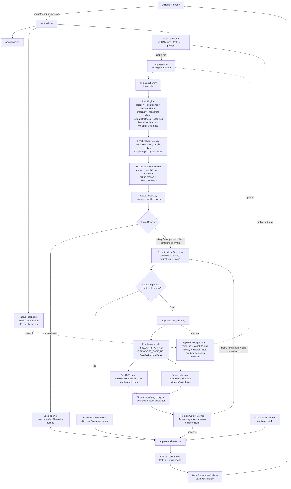
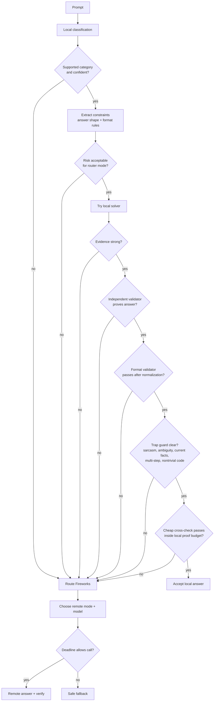
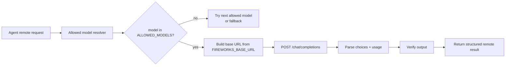
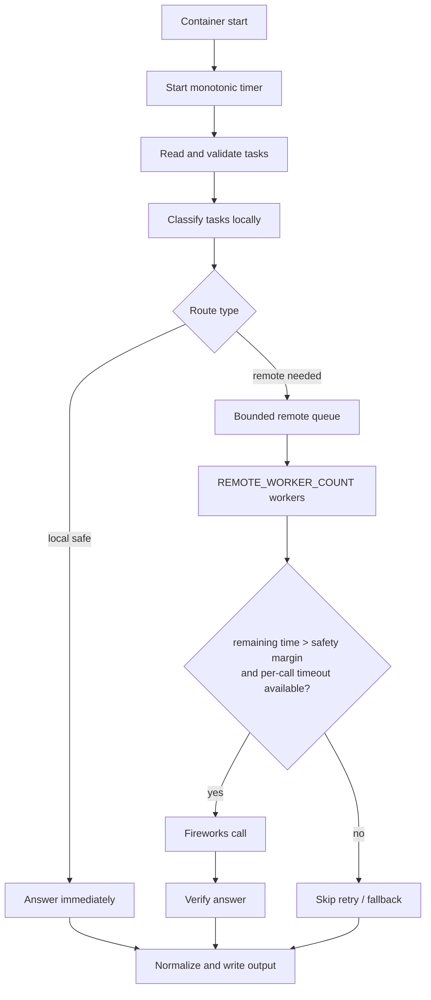
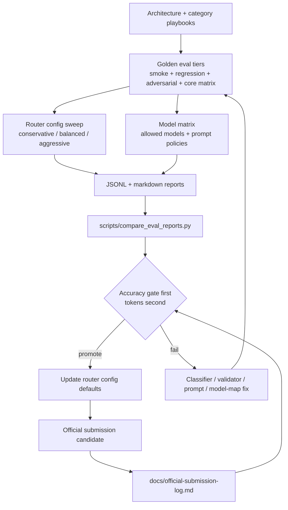

# Planned Architecture Diagram

Purpose: provide a reviewable picture of the intended Track 1 runtime before implementation. The design goal is to maximize accuracy first, then minimize recorded Fireworks tokens.

## End-to-End Runtime

## Component Responsibilities

| Component | Responsibility | Must Not Do |
| --- | --- | --- |
| `app/main.py` | Read official input, validate tasks, call agent, write official output. | Crash whole batch on one bad task or write extra fields to `/output/results.json`. |
| `app/config.py` | Load runtime config from environment with safe defaults. | Require `.env` in final container or log secrets. |
| `app/deadline.py` | Track 10-minute batch budget, safety margin, retry eligibility, and remaining remote-call time. | Sleep, block, or rely on real-time waits in tests. |
| `app/classifier.py` | Classify locally before any Fireworks call. Extract category, confidence, answer shape, constraints, and risks. | Call Fireworks or make final answers directly. |
| `app/solvers/*` | Produce high-confidence local answers with evidence when deterministic. | Guess when confidence or validation is weak. |
| `app/validators.py` | Prove local answers and check remote outputs by category/format. | Accept unverifiable local answers for risky tasks. |
| `app/agent.py` | Own route decision, remote mode choice, deadline checks, retries, and structured result. | Route directly to Fireworks before local classification. |
| `app/fireworks_client.py` | Call Fireworks through injected `FIREWORKS_BASE_URL`, using only `ALLOWED_MODELS`. | Hardcode `https://api.fireworks.ai/...`, bundle keys, or force a fixed model. |
| `app/normalization.py` | Convert final answer to a valid concise string while preserving requested format. | Add metadata to official output. |
| `app/telemetry.py` | Write optional JSONL decision logs for eval/debug/demo evidence. | Leak API keys or change official output. |

## Route Decision Logic

Local acceptance requires all of these to pass:

- category confidence,
- solver confidence,
- risk threshold for selected router mode,
- category validator,
- output-format validator,
- trap guard,
- cheap independent cross-check,
- local proof time budget,
- deadline-safe execution path.

## Remote Call Compliance

Compliance invariants:

- `FIREWORKS_BASE_URL` is the only valid remote inference base URL.
- `ALLOWED_MODELS` is the only model source.
- `FIREWORKS_API_KEY` is read from environment only.
- Missing env, timeout, HTTP error, invalid JSON, missing `choices`, missing `usage`, and disallowed model are handled without crashing the batch.

## Deadline and Concurrency

Deadline defaults should be conservative:

- `BATCH_DEADLINE_SECONDS=600`
- `DEADLINE_SAFETY_MARGIN_SECONDS=60`
- `FIREWORKS_TIMEOUT_SECONDS` below 30 seconds
- small `REMOTE_WORKER_COUNT`, tuned by tests
- retries only when time remains after safety margin

## Eval Feedback Loop

## Main Assessment Questions

Use this list when reviewing whether the architecture is strong enough:

- Does every task get classified locally before Fireworks?
- Are local answers accepted only when there is proof or a strong validator?
- Are hard categories remote by default until tests justify local handling?
- Does every Fireworks call go through `FIREWORKS_BASE_URL`?
- Does model selection come only from `ALLOWED_MODELS`?
- Can one bad task, timeout, or malformed remote response fail the whole batch?
- Can the system write valid output before the 10-minute limit?
- Are route decisions logged well enough to debug failures?
- Do tests cover safe local, risky remote, adversarial, and exact-format cases?
- Can official submission results be traced back to a commit, config, and eval report?
