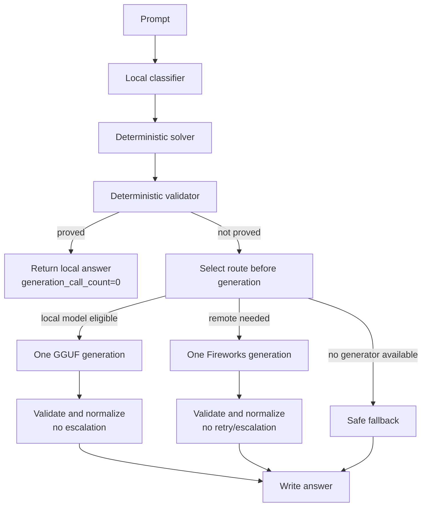

# Single-Generation Routing Contract

Status: current runtime contract for the accuracy-first Track 1 router.

## Goal

Every task is classified and routed before generation. After that, the runtime makes at most one generation call:

- zero calls for deterministic local answers,
- one local GGUF call for local-model answers,
- one Fireworks call for remote answers.

Validators and normalizers are observational/format-preserving. They do not trigger a second model call.

## Execution Flow

## Route Policy

- Deterministic solvers run first and are accepted only when local validation proves the answer.
- Code generation and code debugging route to `kimi-k2p7-code` when remote generation is needed.
- All other remote categories route to `minimax-m3` when available.
- If the preferred remote model is not in `ALLOWED_MODELS`, the router uses the first allowed model.
- The original evaluator prompt is preserved for generation; only a small system instruction is added for Fireworks/local-model calls.

## Removed Runtime Behaviors

- No local-model-to-Fireworks escalation after local validation failure.
- No Fireworks-to-Fireworks retry/escalation after remote validation failure.
- No category prompt-policy rewriting in the runtime path.
- No benchmark-specific remote prompt shaping before generation.

## Telemetry Invariants

Each result records enough metadata to audit routing:

- selected route and model before generation,
- `generation_call_count`,
- classifier category, answer shape, constraints, and risk fields,
- deterministic solver evidence,
- local model attempt/error/validation fields,
- Fireworks HTTP/error fields,
- prompt/completion/total tokens when reported by Fireworks,
- normalization and validation result.

## Output Contract

The official output remains a JSON array of `{ "task_id": "...", "answer": "..." }` objects. Debug metadata is written only to logs/telemetry and never to `/output/results.json`.
